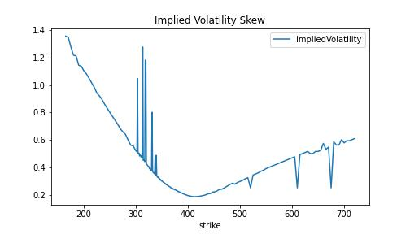
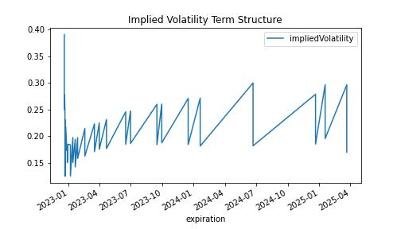
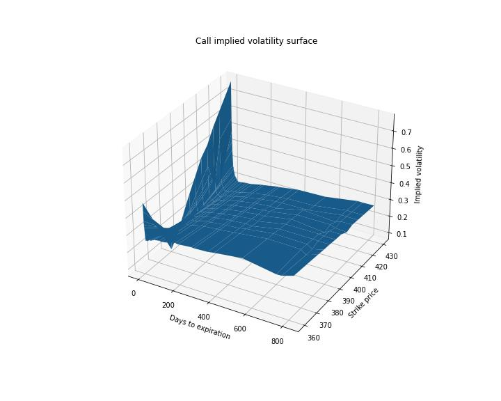

# Implied Volatility Surface

A volatility surface plots the level of implied volatility in 3D space. The days to expiration are on the X-axis, the strike price is on the Y-axis, and implied volatility is on the Z-axis.

Implied volatility is the market’s expectations of volatility over the life of an option. To find implied volatility you need three things: the market price of the option, a pricing model, and a root finder. You can then find the volatility that sets the price from the model equal to the price of the market with the root finder. “The volatility implied by the market.” The volatility surface is found by repeating this for all options and plotting the results.

Pricing models assume volatility is the same for all strike prices and maturities. Volatility surfaces show this assumption is not true. Volatility has skew (volatility is different across strike prices) and a term structure (volatility is different across maturities). Quants use volatility surfaces to help calibrate models and price OTC derivatives that don’t trade on exchanges.

### Volatility surfaces prove the models wrong.

When you value an option, the variables in the model (e.g. stock price, time to expiration) are known except volatility, which is an estimate. If models were completely correct, the volatility surface across strike prices and maturities would be flat. In practice. This is not the case as you’ll see.

**Key Takeawys**
- Get live options data
- Analyze volatility skew
- Analyze volatility structure
- Build an implied volatility surface

---

Import required libraries

numpy 
pandas
yfinance
datetime
matplotlib

---

**File:** [Implied Volatiltiy](ImpliedVolatility.ipynb)

---

## Step 1: Get live options data

yfinance returns data for all strikes for a single expiration at a time. It’s easier to work with all strikes and expirations at the same time so write a function to combine the expirations.

This function:
- gets all the expirations. 
- loops through each expiration and gets the option chain. 
- Adds a column for option type
- changes the expiration date to be at the end of the day
- combines each option chain together in a DataFrame. 
- computes the number of days until expiration.

---

## Step 2: Analyze skew and term structure
yfinance provides an estimate of implied volatility so you don’t have to compute it. This is ok for a quick analysis. In practice, quants derive their own implied volatility using custom models.

Download the data and get the call options. 
(The options data are in a pandas DataFrame which makes it easy.)

Pick an expiration so you can plot the volatility skew.

plot the Implied Volatility Skew

Notice two things:
First, the data is messy. In practice, quants use their own models to calculate implied volatility. They also filter out outliers and use smoothing algorithms. 

Second thing to notice is that the implied volatility varies with each strike. In particular, it is lowest at the $400 strike, which is right around the stock price. This is known as *volatility smile.*

Plot the Implied Volatility Term Structure

Implied volatility is decreasing as the expiration dates get further out. This tells you the market expectation of volatility is lower in the future than it is today. You’ll often see spikes in the term structure when big economic news is scheduled. The effect is caused by traders bidding up the prices of options in expectation of market swings.

## Step 3: Plot a volatility surface
By putting both charts together, you get the volatility surface. In derivatives pricing and trading, volatility surfaces are very important. Quants use the surface to price and trade other more exotic derivatives and look for market mispricings. Volatility surfaces are also used to determine profit and loss by "marking trades to model."

Plot the Implied Volatility Surface

- Pivot the data using pandas
- Put the strike price in the rows
- Put the days to expiration in the columns
- Put the implied volatility inside the table. 

NumPy’s meshgrid method applies a function to every combination of inputs. 

In this case, use it to grab the coordinates for the plot. 

- Use plot_surface to plot days to expiration on the X-axis, strike price on the Y-axis, and implied volatility on the Z-axis.
